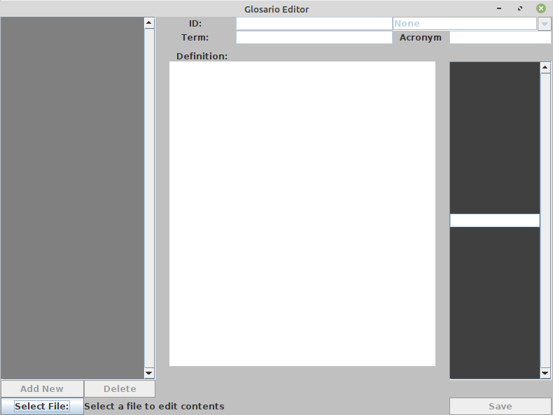
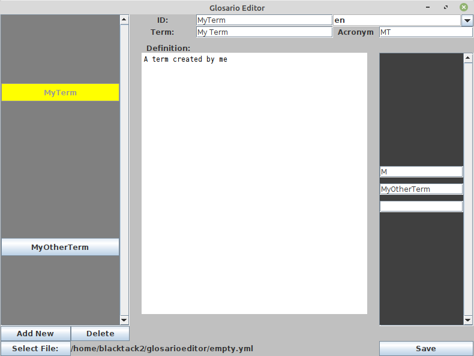

# Glosario Editor

## Main Editor

### How to use

To run the GUI type the following:

```
java -cp glossarioEditor.jar controller.Root
```





The above image shows the default GUI layout obtained by running from Root.

To open a file click the **Select File:** button and browse to your file. If
you run into an error opening the file you can look into the YlmParser section
for more information.

With a file opened you should see the gray area on the left fill with buttons
corresponding to each id in the file. Clicking one of these buttons will select
it, giving you access to change the **ID** field, the language selection box
and the fields in the dark gray panel on the right containing references. These
fields should also be populated with any data corresponding to the selected id.

You can also click the **Add New** button to create a new id, which will be
selected automatically. Upon creating a new id you should populate it with data
since any id's without data are ignored upon saving.

The selection box on the top right holds all of the available languages for a
given id. Selecting one will show the data for that language in the remaining
three fields (those being the **Term** field, the **Acronym** field and the
**Definition** text area). You can also add a new language by typing in the
selection box a two letter id and pressing enter.

### Saving

In order to save you simply need to press the save button on the bottom right.

It should be noted that some data can be silently omitted if incorrectly
formatted. In order to be saved, a given id requires a unique ID and at
least one language.

And for a language to be saved it must have a term and a definition.

The **Acronym** field and the **Reference** fields are optional.

## YmlParser

YmlParser can be run from command line to validate the syntax of a .yml file in
 the form:

```
java -cp glossarioEditor.jar controller.YmlParser filename
```

Where **filename** is a filepath to the intended .yml file.

If this runs into invalid syntax it will print an error corresponding to the
type of invalid syntax and its approximate location in the file. The
following is the format that the .yml file should take:

```
-slug: unique_id
  ref:
    - reference_id1
    - reference_id2
  ln:
    term: "term name"
    acronym: TN
    def: >
      definition here
      can be multiple lines
```

Note: the **ref** and **acronym** sections can be safely omitted.

The following is a sample in the above format:

```
- slug: ide
  ref:
    - repl
  en:
    term: "Integrated Development Environment"
    acronym: IDE
    def: >
      An application that helps programmers develop software.
      IDEs typically have a built-in editor, a console to execute code immediately,
      and browsers for exploring data structures in memory and files on disk.
  es:
    term: "Entorno de Desarrollo Integrado"
    acronym: EDI
    def: >
      Una aplicación que ayuda a programadores a desarrollar software. Los EDI usualmente
      tiene un editor incorporado, una consola que ejecuta el código inmediatamente y
      navegadores para explorar estructuras de datos en la memoria y archivos en el disco.
```
